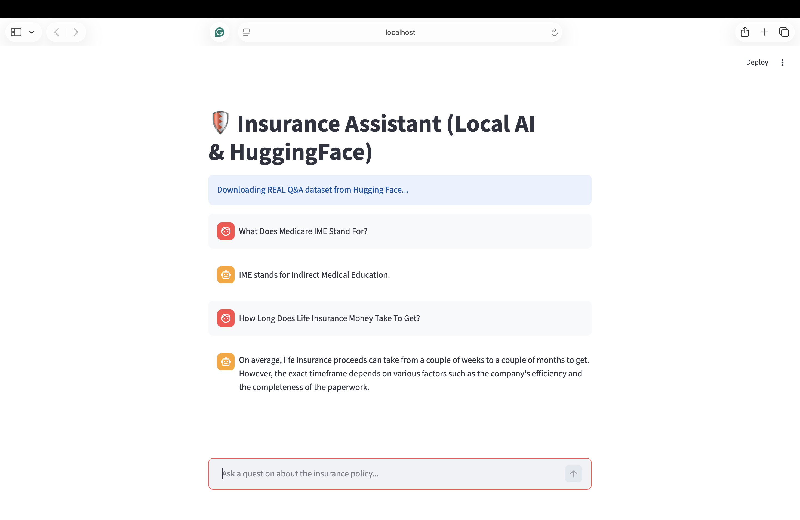
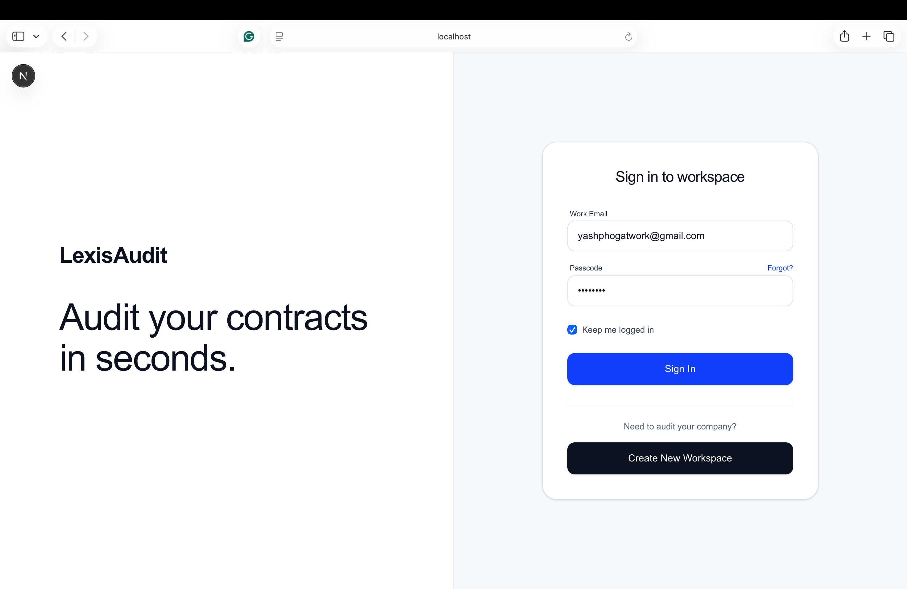
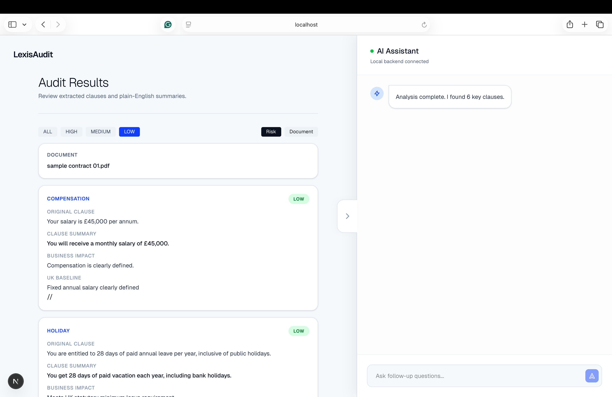
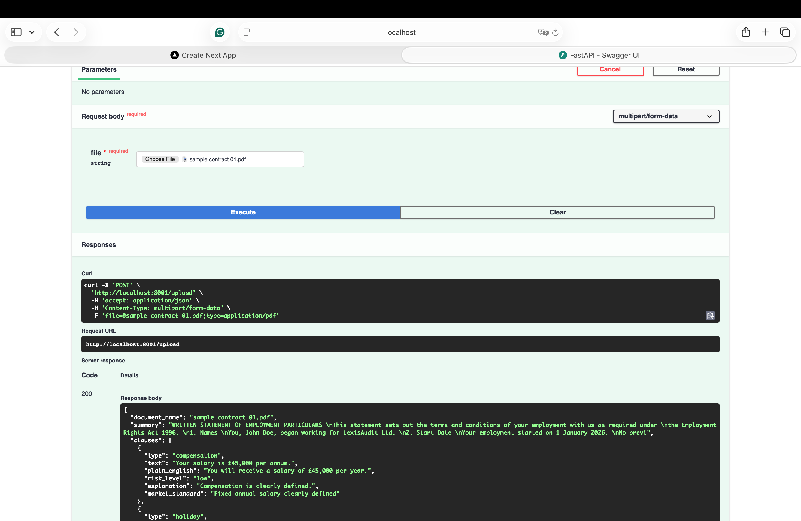

# 🛡️ AI Contract Intelligence System (RAG + Local LLM)

AI-powered contract auditing system that transforms unstructured legal documents into structured, decision-ready insights.

This project evolved from a Retrieval-Augmented Generation (RAG) chatbot into a full contract intelligence pipeline capable of clause extraction, risk classification, and plain-English explanations.

##  What it does
* **Upload employment contracts (PDF/DOCX)**
* **Extract key clauses (compensation, probation, termination, etc.)**
* **Assign risk levels (low / medium / high)**
* **Generate plain-English explanations**
* **Output structured JSON for audit workflows**
* **Enable decision support instead of raw AI responses**

##  System Architecture
 ```bash
Frontend (Streamlit / Next.js)
        ↓
FastAPI Backend
        ↓
Document Parsing (PDF/DOCX)
        ↓
RAG + LLM Pipeline
        ↓
Clause Extraction + Risk Classification
        ↓
Structured Output (JSON)
        ↓
UI Rendering
  ```

##  Demo — V1 (RAG Chatbot)




##  Demo — V2 (Contract Intelligence System)


* **INTRO PAGE**
  



* **POST RUNNING ANALYSIS OF THE DATASET**
  



* **BACKEND FASTAPI IN ACTION**
  


## Tech Stack
* Python
* FastAPI
* LangChain
* FAISS (vector search)
* Hugging Face (embeddings)
* Ollama (Llama 3.2 local inference)
* Pandas
* Streamlit / Next.js

##  Key Highlights
* Built a full-stack AI system from ingestion to structured decision output
* Designed structured outputs instead of raw LLM responses
* Focused on decision-support workflows, not just chatbot answers
* Runs locally with privacy-first architecture (no external API dependency)
* Demonstrates system-level thinking across AI, backend, and product layers

## System Evolution

### V1 — RAG Assistant

* Semantic search + Q&A over insurance dataset
* Local embeddings + local LLM
* Chat-based interaction

### V2 — Contract Intelligence System

* Clause extraction pipeline
* Risk classification (low / medium / high)
* Plain-English explanation layer
* Structured JSON outputs for audit workflows
* Transition from chatbot → decision support system

##  End-to-End Workflow
 ```bash
Document Upload
        ↓
Parsing (PDF / DOCX)
        ↓
Chunking + Embeddings
        ↓
Vector Search (FAISS)
        ↓
LLM Processing (Ollama)
        ↓
Clause Extraction
        ↓
Risk Classification
        ↓
Structured Output
        ↓
UI Rendering
 ```

## Backend & System Design

* **FastAPI-based backend for orchestration and processing**
* **Modular separation of:**
* Frontend (UI interaction)
* Backend (processing & APIs)
* AI pipeline (retrieval + extraction + generation)

## Flow:
 ```bash
Frontend → FastAPI Backend → AI Pipeline → Structured JSON → UI
 ```
## Getting Started
**Prerequisites**
* Python 3.8+
* Node.js (for frontend)
* Ollama installed ([Download here](https://ollama.com/)).

## Setup and Running the Project

**Backend and frontend are separated:**

* FastAPI handles processing and APIs
* Next.js handles UI rendering

Run locally using a standard Python + Node.js setup.

## Positioning

This project demonstrates how LLM-based systems can move beyond chat interfaces into structured, decision-support applications.

It focuses on transforming complex legal text into interpretable, actionable insights for real-world use cases.
## 
